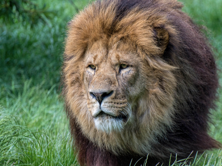

# PyTorch Rocket ESRGAN - Tutorial 1: The Magic Mirror
    Have you ever wanted to test multiple Deep Learning models and compare their results very easily?

    Are you tired of picking a Deep Learning model just because it is the only one you are able to run?

We want to solve this problem and we packaged 1 state-of-the-art Super-Resolution Deep Learning models for  you to easily test it.

We are calling this new way of packaging Deep Learning models: __Rockets__.

__Welcome to the Rockets Scientists Community!!!__

## Install the repositories
We recommend you to use an isolated Python environement such as [virtualenv](https://virtualenv.pypa.io/en/latest/) or [conda](https://docs.conda.io/en/latest/) with at least __Python 3.5__. Then you can use the following lines of code:
```
git clone https://github.com/LucasVandroux/PyTorch-Rocket-ESRGAN
cd rockethub-tutorial0
pip install -r requirements.txt
```
### Install PyTorch
As the installation for PyTorch is different for each platform, you need to look at the [PyTorch installation guide](https://pytorch.org/get-started/locally/). Don't worry it is very simple, maximum 2 lines of codes :stuck_out_tongue_closed_eyes:

## The Magic Mirror
For this tutorial, we selected the state-of-the-art model in Super-Resolution for you to play with. It means that now you are able to improve the resolution of your images in just a few line of codes:
1. ESRGAN: Enhanced Super-Resolution Generative Adversarial Networks ___[[paper]](https://arxiv.org/pdf/1809.00219.pdf)___

## Run the GAN model
Everything is happening in the `improve.py` file. There you can choose which image to use with just one line of code.

Once you are ready you just need to run `python improve.py` and everything will happen magically.

Don't hesitate to play around by using different images with the ESRGAN Rocket. We recommend to use `.png` images instead of `.jpg` as the compression in the last one seems to decrease the quality of the improved image.

## Outputs of the Rocket
| Filename | Original | Improved | 
|----------|----------|-----------|
| `girl1.png` |  |  |
|`girl2.png`|||
|`lion.png`|||

## Contact
Any feedback or complaint from your neighbors about the noise your Rockets are making, please contact us at [hello@mirage.id](mailto:hello@mirage.id). 
